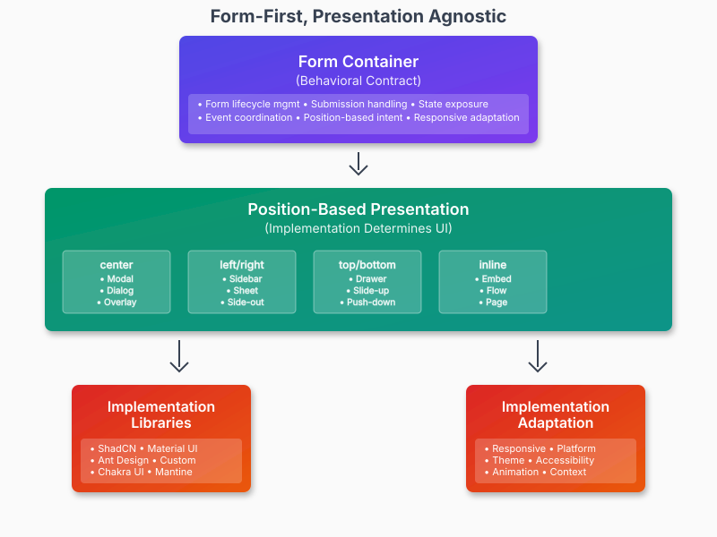

## Appendix F: Mental Model - Form-First, Presentation Agnostic

### Core Principles

#### 1. Behavioral Contract Over Visual Specification
The protocol defines **what forms do** (lifecycle, state management, submission flow) rather than **how they look** (colors, animations, exact positioning).

#### 2. Position as Pattern Intent
Position values communicate **interaction patterns** familiar to users:

center → "I need focused attention (modal pattern)"
right → "I'm supplementary to main content (sidebar pattern)"
bottom → "I slide up from edge (drawer pattern)"
inline → "I'm part of content flow (embedded pattern)"

#### 3. Responsive Adaptation as First-Class Concern
Containers SHOULD adapt their presentation based on context (viewport, platform, user preferences) while maintaining consistent form behavior.

#### 4. Framework Implementation, Universal Contract
Each framework implements the protocol using its own patterns (React hooks, Vue composables, Svelte stores) while honoring the same behavioral contract.
