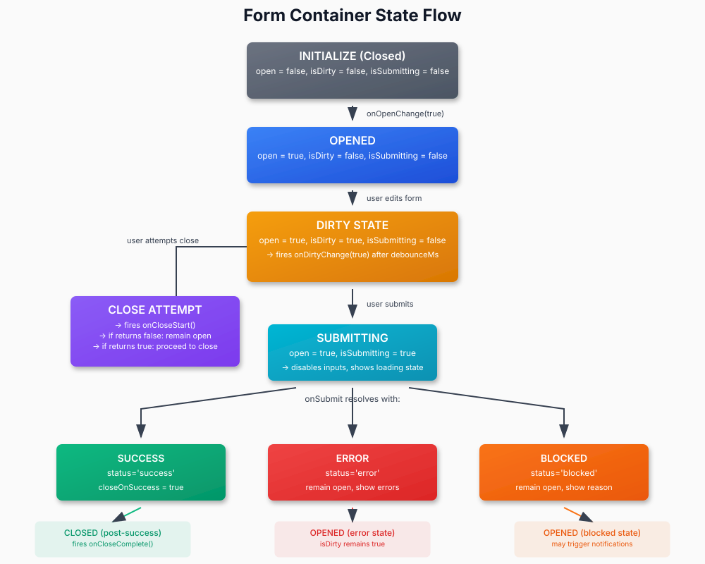

## Appendix J

### Key Transition Rules
- Dirty Tracking  
  - Any change from initial values sets isDirty=true and fires onDirtyChange(true).  
  - Resetting form or closing with resetOnClose=true sets isDirty=false.
- Prevent Close When Dirty  
  - If preventCloseWhenDirty=true, onOpenChange(false) is ignored until isDirty=false.
- Submission Lock  
  - While isSubmitting=true, ignore further submit attempts and disable close unless explicitly allowed.
- Error Handling  
  - SubmitResult.error populates notifications slot and/or inline field errors.
- Blocked Handling  
  - SubmitResult.blocked keeps container open, may trigger global alerts.